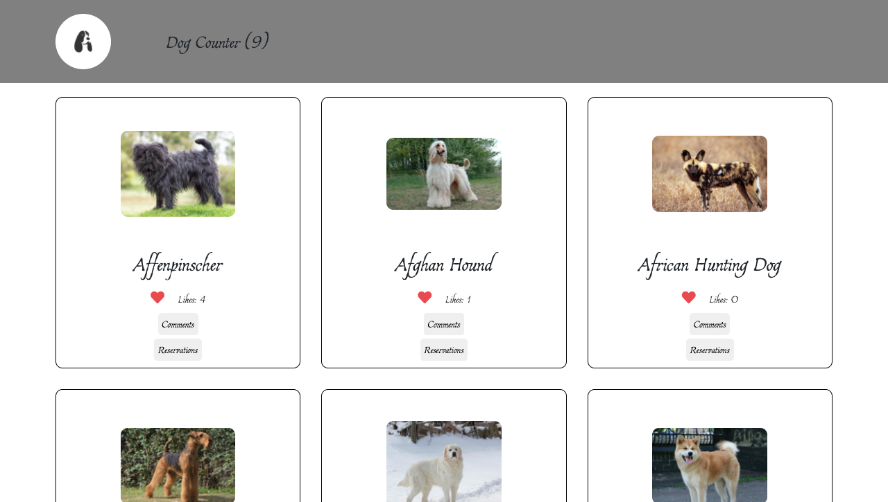

# Dog Counter

> Capstone project for Module 2 of Microverse.



## Built With

- HTML
- CSS
- JavaScript
- Webpack

## Getting Started

Clone the repo and enter the directory.

```shell
git clone https://github.com/piero-vic/capstone-js.git && cd capstone-js
```

After this you can run the app by opening `index.html` under the `dist` directory.

If you want to experiment with the app follow these simple example steps.

### Prerequisites
You need to have `npm` installed on your local machine.

### Install
Install the npm packages.

```shell
npm install
```

### Usage

Run `npm run start` to start the local server and try the app.

```shell
npm run start
```

## Author(s)

👤 **Piero Lescano**

- GitHub: [@piero-vic](https://github.com/piero-vic)
- Twitter: [@v1ccenzo](https://twitter.com/v1ccenzo)
- LinkedIn: [piero-lescano](https://linkedin.com/in/piero-lescano)

👤 **Ihedoro Fortunatus Onyekachi**

- GitHub: [@fortuneonyeka](https://github.com/fortuneonyeka)
- Twitter: [@onyekafortune](https://twitter.com/onyekafortune)
- LinkedIn: [Ihedoro Fortunatus](https://www.linkedin.com/in/fortunatus-ihedoro/)

👤 **Fondem Junior**

- GitHub: [@Fondem-Jr](https://github.com/Fondem-Jr)
- Twitter: [@OpportunistZeus](https://twitter.com/OpportunistZeus)
- Linkedin: [fondem-junior](https://www.linkedin.com/in/fondem-junior-57484744/)

## 🤝 Contributing

Contributions, issues, and feature requests are welcome!

Feel free to check the [issues page](../../issues/).

## Show your support

Give a ⭐️ if you like this project!
